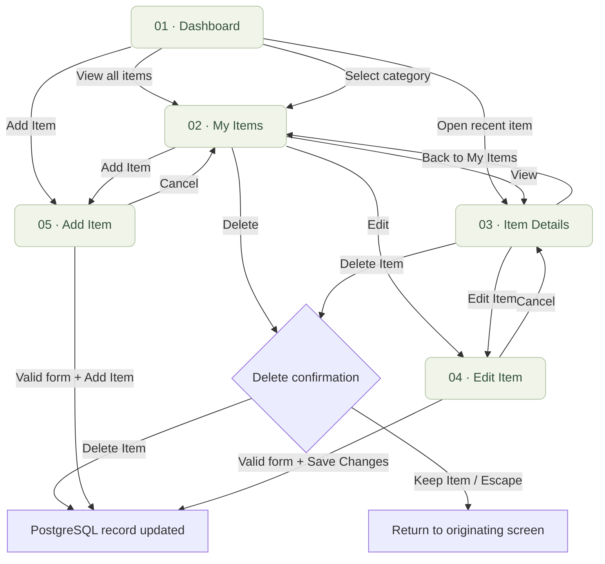

# Gamit Check — application wireframe reference

This document records the visual and navigation reference for the implemented React application. A new inventory starts empty, while add, edit, photo, and delete actions persist through Express and PostgreSQL.

## Screen flow

Dashboard, My Items, and Add Item are always reachable from the sidebar or mobile menu. Item Details and Edit Item become available after an item exists.

## Shared visual language

| Element          | Reference                                                    |
| ---------------- | ------------------------------------------------------------ |
| Page background  | Soft off-white `#f7f8f5`                                     |
| Primary action   | Forest green `#386d53`                                       |
| Primary text     | Dark green `#293b32`                                         |
| Panels           | White, subtle borders, 10–12 px rounded corners              |
| Typography       | Manrope headings; DM Sans body and controls                  |
| Spacing          | Consistent page gutters; 12–28 px component gaps             |
| Condition labels | Text + color + a dot: New, Good, Fair, Damaged               |
| Navigation       | Persistent desktop sidebar; expandable mobile menu           |
| Forms            | Visible labels, marked required fields, optional-field hints |
| Item visuals     | Uploaded photos with muted vector artwork as the fallback    |

## Desktop and mobile behavior

| Screen       | Desktop                                                   | Mobile                                                                         |
| ------------ | --------------------------------------------------------- | ------------------------------------------------------------------------------ |
| Dashboard    | Zero-valued summary cards and an empty-inventory panel    | Compact summary row and a responsive empty-inventory panel                     |
| My Items     | Table or card grid, search and category tools, pagination | Responsive cards with item information and explicit View, Edit, Delete actions |
| Add Item     | Form with paired fields and a contextual tip panel        | Single-column fields on narrow phones; full-width form                         |
| Item Details | Photo or fallback artwork beside item information         | Photo or artwork above information and notes                                   |
| Edit Item    | Prefilled form beside a sample-item reference             | Prefilled form with vertically arranged fields                                 |

At tablet sizes, inventory cards replace the table. At 760 px and below, navigation moves into a menu while the app name remains visible in the header. Layouts support screens as narrow as 320 px.

## Form field reference

| Field         | Required | Control                                                                          |
| ------------- | -------- | -------------------------------------------------------------------------------- |
| Item name     | Yes      | Text input                                                                       |
| Category      | Yes      | Electronics, Clothes, Sports Equipment, Gaming, School Items, Accessories, Other |
| Brand         | No       | Text input                                                                       |
| Condition     | Yes      | New, Good, Fair, Damaged                                                         |
| Location      | No       | Text input, e.g. Bedroom · Desk                                                  |
| Date acquired | No       | Date input                                                                       |
| Notes         | No       | Multiline text                                                                   |
| Item photo    | No       | JPEG, PNG, or WebP file up to 3 MB                                               |

## Implemented scope

The application connects these screens to Express and PostgreSQL CRUD operations. Search, filters, sorting, and pagination use server queries. Item photos can be uploaded, replaced, viewed, and removed, and all actions have automated API and browser coverage.
