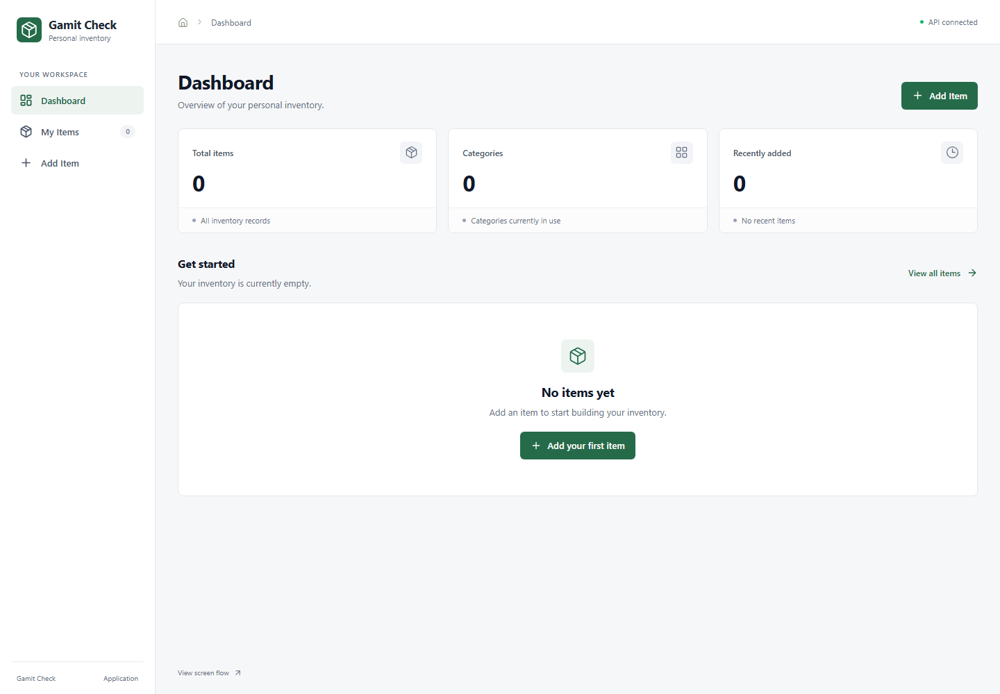

# Gamit Check screenshot gallery

Full-page screenshots of the functional Gamit Check application, captured in Chromium at 1440 px desktop and 390 px mobile widths.

Dashboard and My Items show a new empty inventory. Item Details, Edit Item, and Delete confirmation use a temporary screenshot record that was removed immediately after capture.

| Screen              | Desktop                                    | Mobile                               |
| ------------------- | ------------------------------------------ | ------------------------------------ |
| Dashboard           | [Desktop](dashboard-desktop.png)           | [Mobile](dashboard-mobile.png)       |
| My Items            | [Desktop](my-items-desktop.png)            | [Mobile](my-items-mobile.png)        |
| Add Item            | [Desktop](add-item-desktop.png)            | [Mobile](add-item-mobile.png)        |
| Item Details        | [Desktop](item-details-desktop.png)        | [Mobile](item-details-mobile.png)    |
| Edit Item           | [Desktop](edit-item-desktop.png)           | [Mobile](edit-item-mobile.png)       |
| Navigation flow     | [Desktop](navigation-flow-desktop.png)     | [Mobile](navigation-flow-mobile.png) |
| Delete confirmation | [Desktop](delete-confirmation-desktop.png) | —                                    |

The running application is the source of truth for interactions. These screenshots document the current responsive interface for project review and presentations.

